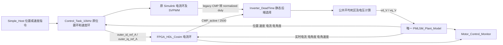

# PMLSM 三闭环模型：信号、后端切换与学习指南

适用模型：`simulink模型/PMLSM_ThreeLoop_Simple.slx`，MATLAB R2026b Prerelease Update 3。PR33 已合并；本文及正式命名模型在后续分支 `codex/pmlsm-formal-signals-guide`，合并前请让 ChatGPT 读取该分支。底层是 Vivado Simulator/XSI 联合仿真，目前没有连接实物 FPGA。

## 1. 先理解完整控制链



`Simple_Host` 是仿真上位机。三闭环时，它发出位置目标，轨迹发生器产生平滑的 `x_ref_mm`；位置环产生速度参考，速度 PI 产生 q 轴电流参考，电流环产生电压/PWM。`host_iq_test_ref_A` 只属于电流测试入口，不能拿来代替三闭环的速度 PI 输出。

`Control_Task_10kHz` 保留原有位置/速度外环和 reference manager。`outer_id_ref_A`、`outer_iq_ref_A` 是 reference manager 选出的电流参考；FPGA live 模式接这里。原控制任务中的 legacy 电流算法仍然存在，是否驱动 plant 取决于后端选择。

`FPGA_HDL_Cosim` 把实时输入转换成 HDL 所需的定点格式，通过 XSI 驱动真实 RTL，读回已经生效的 active CMP 和状态。它不是物理 FPGA 设备接口。`fpga_id_ref_A`/`fpga_iq_ref_A` 监视的是适配器选中的、量化前的参考；它们不等同于所有模式下 plant 正在采用的参考，也不代表该参考已经装载到 PWM。

`Inverter_DeadTime` 选择一组 ideal normalized duty，再共同经过原平均死区模型。legacy 路径保留半 PWM 周期更新延迟及 `-counts/PMLSM_pwm_period_counts + 1`；FPGA 路径用 `CMP_active/2500`，不再经过那次延迟和极性转换。公共顺序是 deadtime correction → d_sum → d_sat[0,1] → v0_eff_calc。legacy 没有新增 pre-deadtime saturation；FPGA 的 [0,1] guard 是接口保护。

`PMLSM_Plant_Model` 是唯一被驱动的电机模型。位置、速度可自由运动，没有锁定或新增行程限制。`Motor_Control_Monitor` 只记录，不参与控制。

## 2. 两种后端怎样切换

这是**启动仿真前的静态切换**，不支持运行中热切换。保存的模型默认 `CONTROL_BACKEND=0`。

| 配置 | 原 Simulink 后端 | FPGA 三闭环后端 |
|---|---|---|
| `CONTROL_BACKEND` | `0` | `1` |
| 驱动 plant 的电流环 | 原 Simulink 电流环 | Vivado Simulator 中的 RTL |
| `FPGA_Cosim_Enable` | 不决定 legacy 的选择 | `1` |
| `FPGA_Cosim_Input_Mode` | 并联适配器选择；不决定 plant 后端 | `1`，live 电流/角度等 |
| `FPGA_Reference_Mode` | 不决定 plant 后端 | `1`，原外环参考 |
| 配套 | 无需初始化 XSI | 有效 XSI runtime、正确运行目录、1 μs exchange/plant 步长 |

`Input_Mode=0` 是固定 smoke 输入；`Reference_Mode=0` 是阶段测试的 scripted 电流参考。这两个 0 都不是“三闭环 live”。仅修改 `CONTROL_BACKEND` 后直接点击 Run，不能保证其他设置正确。

### 推荐可复现入口

在一个独立 R2026b 会话运行，模型不要在**这个会话**中预先加载；另一个 MATLAB 桌面仅打开界面不妨碍运行。脚本在内存中配置模型，退出后关闭自己的模型且不保存测试改动。

```matlab
cd('D:/Project/FPGA_XC7A200T');
addpath(fullfile(pwd,'scripts'));
addpath('C:/Users/lww/.matlab/agentic-toolkits/simulink');
satk_initialize;

% 第一次使用，或 RTL 改变后，先重建本地 XSI 仿真 runtime：
step7c_generate_foc_cosim(1e-6,true);

% 同一套 1 mm 位置轨迹，分别选择原后端和 FPGA 后端。
stamp=char(datetime('now','Format','yyyyMMdd_HHmmss_SSS'));
legacy=step7d_run_scenario('position_deadtime',0,1e-6, ...
    fullfile(pwd,'docs','reports','step7d',['demo_legacy_' stamp]));
fpga=step7d_run_scenario('position_deadtime',1,1e-6, ...
    fullfile(pwd,'docs','reports','step7d',['demo_fpga_' stamp]));

figure;
tiledlayout(3,1);
nexttile; plot(fpga.time_s,[fpga.x_ref_mm fpga.x_mm legacy.x_mm]);
ylabel('位置 / mm'); legend('参考','FPGA','legacy'); grid on;
nexttile; plot(fpga.time_s,[fpga.iq_ref_A fpga.iq_A]);
ylabel('q轴电流 / A'); legend('外环参考','实际'); grid on;
nexttile; plot(fpga.time_s,fpga.duty_selected);
ylabel('占空比'); xlabel('时间 / s'); legend('u','v','w'); grid on;
```

原后端单独运行时可跳过 runtime 重建和 FPGA 那次调用。`step7c_generate_foc_cosim` 的名字是历史阶段名，但生成的就是当前 RTL 仿真 runtime，不生成 bitstream。工具路径只作用于本 MATLAB 进程并在结束后恢复，不修改 Windows 全局 PATH。

需要快速验证时将场景改为 `convergence_prefix`，运行 0.2 s 的位置启动段；它不能证明完整到位性能。完整 `position_deadtime` 是 1.2 s 仿真，实际等待时间会更长。报告目录必须是新目录。

该运行器明确设定 1 mm 目标、0.05 s 开始、速度/加速度/加加速度上限 5/50/1000，并通过模型初始化后覆盖来确保生效。模型初始化文件中的常规 Host 默认目标仍为 100 mm，不能混为同一个实验。直接在 base workspace 改 Host 数值可能被模型 `InitFcn` 的 workspace reload 覆盖；学习和比较请先使用以上入口。

## 3. 正式信号名和观测方法

名称末尾 `_A`、`_V`、`_mm`、`_mmps`、`_rad`、`_radps` 表示单位；`ref` 表示参考，`active` 表示已经生效。`fpga_duty_u/v/w` 是 0–1 无量纲数。`cmp_*_active` 是计数值，名字沿用 HDL 接口定义。

| 信号 | 含义 |
|---|---|
| `x_ref_mm` / `x_mm` | Host 轨迹位置 / 实际机械位置 |
| `host_v_ref_mmps` / `v_mmps` | Host 速度模式指令 / 实际机械速度；位置模式下前者不是位置环输出 |
| `host_id_ref_A` / `host_iq_test_ref_A` | Host 的 d 轴参考 / 专用 q 轴测试指令 |
| `outer_id_ref_A` / `outer_iq_ref_A` | 原 reference manager 最终选出的电流参考，供 live FPGA 输入 |
| `fpga_id_ref_A` / `fpga_iq_ref_A` | FPGA 适配器选中的量化前参考 |
| `id_A` / `iq_A` | 实际 dq 电流 |
| `ia_A` / `ib_A` / `ic_A` | 实际三相电流 |
| `theta_e_rad` / `omega_e_radps` | 电角度 / 电角速度，不是机械位置/速度 |
| `vdc_V` / `vd_V` / `vq_V` | 母线电压 / 实际施加给 plant 的 dq 电压 |
| `accepted_sample_id` | HDL 接受的输入事务编号 |
| `active_command_id` | 已装载生效的 PWM 命令编号 |
| `active_valid` | 生效命令有效标志 |
| `fpga_bridge_enable` | FPGA 输出侧综合有效/故障/复位条件后的使能 |
| `fault_code` / `needs_reset` | 故障码 / 必须重新复位标志 |

From/Goto 使用 local 作用域，方括号中的文字是信号标签；模块下面的块名称隐藏。`Read_<实际信号>_<SID>` 的最后数字只用于区分同一信号的多个读取块，不是新的中间信号。底层 HDL 端口、历史脚本/API 名和内部控制公式中的数学变量保持兼容，不机械替换这些代码符号。

### `motor_control_monitor` 的固定列顺序

To Workspace 输出为 timeseries：`Time` 是秒，`Data(:,k)` 对应下表。本次仅改名，列顺序和类型不变。

| 列 | 名称 |
|---|---|
| 1–2 | `fpga_id_ref_A`, `fpga_iq_ref_A` |
| 3–4 | `id_A`, `iq_A` |
| 5–7 | `ia_A`, `ib_A`, `ic_A` |
| 8–9 | `x_mm`, `v_mmps` |
| 10–11 | `theta_e_rad`, `omega_e_radps` |
| 12–14 | `cmp_u_active`, `cmp_v_active`, `cmp_w_active` |
| 15–17 | `fpga_duty_u`, `fpga_duty_v`, `fpga_duty_w` |
| 18–20 | `accepted_sample_id`, `active_command_id`, `active_valid` |
| 21–23 | `fpga_bridge_enable`, `fault_code`, `needs_reset` |
| 24–25 | `vd_V`, `vq_V` |

`fpga_interface_monitor` 是适配器内部日志：前 3 列 active CMP，第 4–8 列依次 accepted ID、active ID、valid、needs_reset、fault_code，第 9–11 列 raw duty，第 12 列起为各输入 range flags。它的列顺序**不同于**主监视器。

backend=0 时不要把 FPGA 命令/状态列当作正在驱动电机的证据。场景运行器返回的 `r.id_ref_A`/`r.iq_ref_A` 直接记录原 reference manager，`r.duty_selected` 记录后端选择后的 duty，比较两个后端优先看这些字段。历史 MAT 仍保留旧日志名 `step7c_monitor`/`fpga_monitor`；`pmlsm_get_monitor` 兼容读取，新仿真使用正式名。

## 4. 时序和职责边界

- 原位置环 10 ms、速度环 1 ms、电流控制/PWM 100 μs；不因本次改名而改变。
- HDL 时钟 20 ns；联合仿真参考 exchange 和 plant 步长 1 μs。1 μs 不是 PI 更新周期。
- 输入被接受与命令 active 装载不是同一时刻。验收检查约 50 μs 的延迟，应该按 command ID 配对，不能按相邻波形点猜测。
- `PI_PROFILE=0`；PR33 的 AUM3-S4 电流 PI 为 Kp=8.725、Ki=11850、KiTs=1.185，本次没有调参。
- RTL 的六路 PWM 门极死区和 Simulink 的平均电压死区是不同层面的对象；当前 plant 用平均模型，不以门极波形直接驱动开关器件。
- PWM 禁止后 HDL 可锁存 `needs_reset`，重新置位 PWM 或 PI reset 不等于全局复位。当前支持独立 fresh-start，不宣称支持热重启。

## 5. 给 ChatGPT 的教学请求

把本文在当前 PR 分支上的 GitHub 链接发给 ChatGPT，并附上下面的话：

> 请先读取 PMLSM_MODEL_GUIDE_ZH.md、scripts/step7d_scenarios.m、scripts/step7d_configure_model.m 和 coordination/reports/step7d_pr33_revision_report.md。按“Host → 位置环 → 速度环 → 电流环 → duty → 公共逆变器/死区 → plant → 反馈”的顺序教我，每次只讲一段。先让我分清 Host 测试电流、外环电流参考和 FPGA active 命令，再解释 CONTROL_BACKEND 如何选择两条路径。请用当前代码和验收证据，不把 HDL 联合仿真说成已经上板，也不要建议我自行改 PI 或控制周期。每段给一个应观察的变量和一个理解问题。

SLX 是二进制，ChatGPT 只读网页通常看不到内部图；请结合本文、信号表和随本次提交的模型截图教学。完整控制性能证据见 [Step 7D 报告](../coordination/reports/step7d_pr33_revision_report.md)，本次名称迁移的独立验证见 [名称整理报告](reports/step7d/formal_names_20260923/README.md)。
