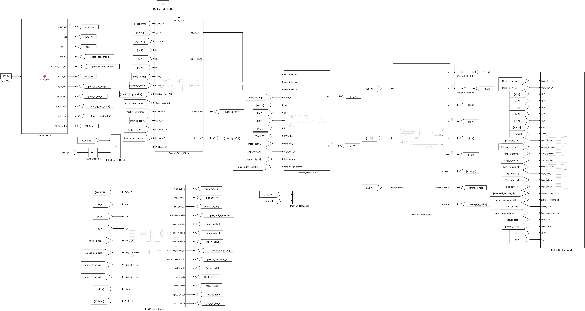
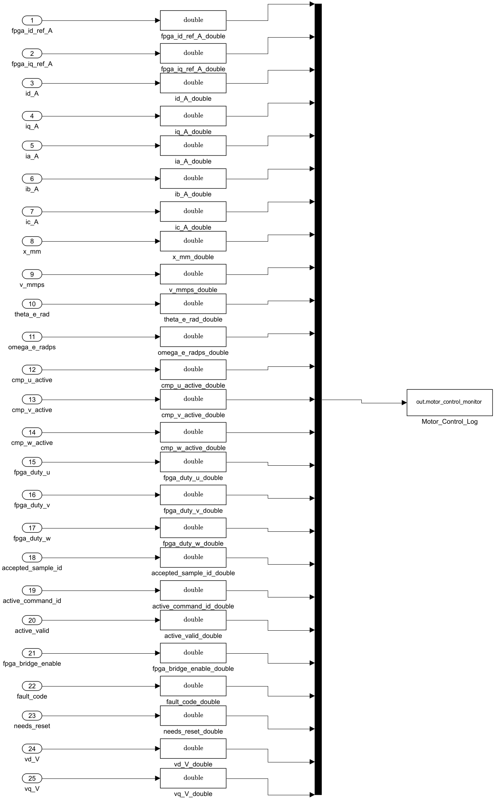

# 正式信号命名与教学文档交付

2026-09-23，在原始 `D:/Project/FPGA_XC7A200T` 工作树，基于用户最新保存的 R2026b SLX 修改。交付模型同时包含此前用户要求的 local From/Goto 布局整理；没有覆盖用户其他文件。

## 本次变化

- 主图标签区分 Host 测试请求、原外环选中参考、FPGA 适配器参考和实际反馈，加入明确单位。
- `Step7C_Monitor` 改为 `Motor_Control_Monitor`；正式日志为 `motor_control_monitor`、`fpga_interface_monitor`。
- 193 个块重命名或标签更新，完整对应关系见 [name_mapping.csv](name_mapping.csv)。内部 HDL 端口/控制公式及历史脚本名称保持兼容。
- 当前运行器读取正式日志，同时兼容历史 MAT 的旧日志名；不修改旧报告/数据。
- local From/Goto 的块名保持隐藏。为完整显示较长标签，仅调整相关路由块的宽度/位置/字号；所有 Inport/Outport 几何不变。
- [中文指南](../../../PMLSM_MODEL_GUIDE_ZH.md) 解释 Host、三闭环、两种后端、单位、日志列顺序、可运行入口和 ChatGPT 教学提示。说明放在文本文件中，便于网页端 ChatGPT 阅读。

## 本次新鲜验证

1. R2026b Toolkit 检查 root、FPGA wrapper、两个 monitor 均 healthy；保存模型 update 通过。
2. [结构审计](structural_check.txt)：1094 个既有块身份保持；358 个 Inport/Outport 全参数（包括 Port、Position、形状）保持；原始信号连接、From/Goto 的实际生产者、Stateflow 内容和 solver 配置保持。允许差异仅限名称、标签、路由块显示和两个日志变量名。
3. 实际运行 `convergence_prefix`，每次 0.2 s、1 μs 步长，legacy 和真实 Vivado/XSI 后端分别抓取修改前/后结果，共四次。含 0.05 s 后的非零位置运动，不是仅编译或静止冒烟。
4. [逐项数值对比](numeric_equivalence.txt)：22 个返回字段，加两类完整采样率的监测日志，两个后端的最大差异全部为 **0**，满足 `<=1e-10`。正式日志存在，旧日志兼容读取通过。
5. 后续仅为可读性缩短主控制器输入标签连线、调整 From 字号；最终结构审计和模型 update 再次通过。已人工查看最终主图和 monitor 导出图，修正 `-T-` 隐藏标签及标签重叠。

修改前 MAT 和原始 SLX 保存在本地 `.superpowers/model_names_20260923/`；四次仿真的原始 SimulationOutput 保存在 `.Xil/step7d/<run_id>/simulation_output.mat`，后测 run ID 见 [legacy](legacy_after/run_summary.txt) / [FPGA](fpga_after/run_summary.txt)。原始大文件未提交。审计脚本接受修改前文件路径，不把远端 HEAD 当成用户本地基线。

这是名称/显示迁移的有界验证，没有重新声称完成一次全量 Step7D 性能验收。PR33 的完整性能验收仍见 `acceptance_20260922_205317_302`。本次没有改 RTL、PI、控制周期、CMP/2500、公共死区或唯一自由运动 plant；不生成 bitstream、不操作硬件、不合并 PR。

