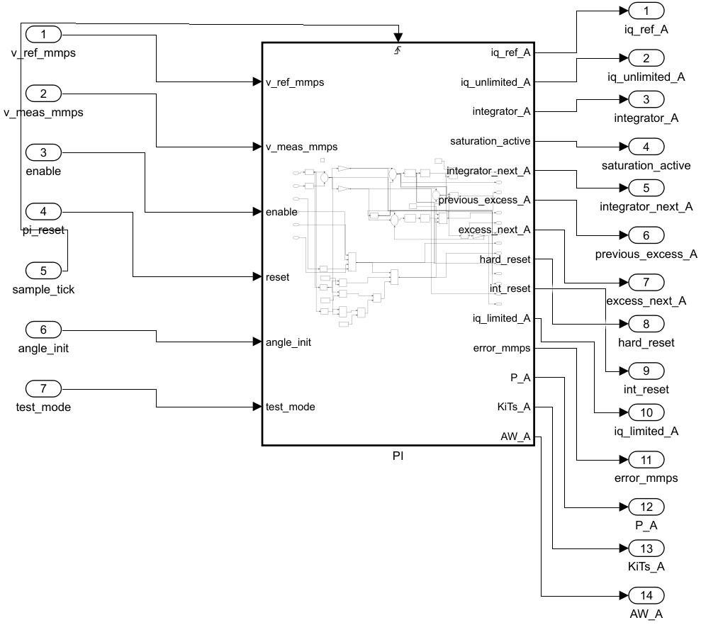
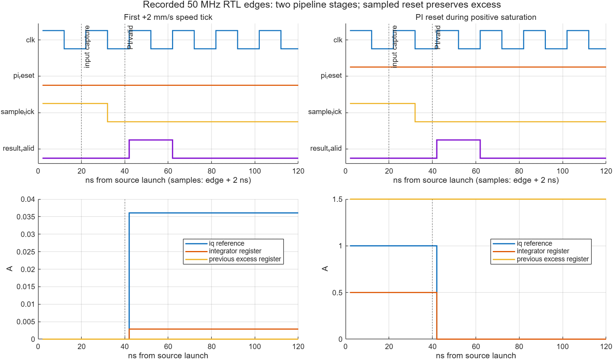

# Study-L1 Checkpoint B：从冻结 B1 读到生成 RTL

本次 baseline 已通过 fresh verification。生成 RTL 对同一组 2580 样本 / 258 speed tick 的 14 项 B1 raw code 全部一致；50 MHz OOC 核级布线 WNS=+0.324 ns。B1 数值模型、previous excess、reset/enable 和 anti-windup 均保持冻结。

## 先打开这四个入口

1. [冻结 B1 datatype table](../checkpoint_a/datatype_table.md)：先看位宽、小数位、Convergent 舍入和 Saturate 溢出。
2. [HDL-facing Simulink 模型](../../models/speed_pi_hdl.slx)：打开 `speed_pi_hdl/HDLCore/PI` 阅读与 B1 相同的图。
3. [生成顶层 HDLCore.sv](../../generated_hdl/baseline/HDLCore.sv)：看输入寄存器和时钟接口。
4. [生成 PI.sv](../../generated_hdl/baseline/PI.sv)：看运算、状态寄存器与输出保持。

Carrier 复制冻结 B1，仅显式规定根输入类型、把 tick 承载改为 boolean、把外部算法 reset 命名为 `pi_reset`，并增加可选为 DUT 的 `HDLCore`。PI 内部所有模块参数及连线逐项一致，见 [semantic fingerprint](pi_semantic_fingerprint.json)。新模型在 Simulink 中与 B1 的全部 14 项输出逐样本 raw-exact；B1 文件没有保存或重建。

## 先分清时钟、sample tick 和两个 reset

`clk` 始终是 50 MHz。`clk_enable` 是全局流水线 CE，本测试常态为 1。`sample_tick` 是输入事务的 rising-edge 事件：第一拍 0.9 ms（45,000 个物理周期），之后 1 ms（50,000 周期）。保持 tick 为高不会重复积分；没有 tick 时，`pi_reset` 或 disable 不更新 PI 状态。

生成头部的 100 us 是源模型的 logical base rate。`TreatRatesAsHardwareRates=off`；RTL 每个物理时钟可承载一个逻辑输入，testbench 每 5000 clocks 才更换一个原测试向量。1 ms 的积分系数 `Ki_ASR*Ts_ASR` 保持原值，不因 50 MHz 而改成 `Ki/50e6`。

`init_reset` 是 HDL 同步上电/初始化 reset：优先于 CE，清初始化状态及流水线。算法的 `pi_reset` 与 `enable` 是随输入数据对齐的命令，只在 speed 事件上参与 hard/int reset。日常算法 reset 应送 `pi_reset`，它不清 PreviousExcess；使用 `init_reset` 会重新初始化整个核。

上电期间保持 `sample_tick=0`，释放 `init_reset` 后先运行至少两个 CE 周期，再开始首 speed 事件。这使输入 pipeline 和初始化为 1 的内部 tick-delay 完成低电平建立；本测试在 0.9 ms 首事件前完成该建立过程。

`ce_out` 直接等于全局 CE，并不是“每 1 ms 有新结果”。testbench 把源 tick 的 rising-edge 事件经过两个受 CE 控制的 valid 寄存器，形成 `result_valid`，与 Coder 的两级边界 latency 对齐。global CE 暂停时必须以 CE 同步保持这个 valid 管线。

## 沿数值路径阅读

有效事务仍计算：`e=ref-meas`、`u=Kp*e+x_old`、`l=clip(u,±1)`、`d_next=u-l`、`candidate=clip(x_old+KiTs*e-Kaw*d_old,±0.5)`。`iq_ref=hard?0:l`，`x_next=int_reset?0:candidate`。状态更新使用上一 tick 的 excess；输出使用旧积分状态。

| Model 中的对象/功能 | 生成 RTL 入口 | 阅读重点 |
|---|---|---|
| Error | [PI.sv:136](../../generated_hdl/baseline/PI.sv#L136) | v_ref - v_meas; signed33/20 |
| P | [PI.sv:137](../../generated_hdl/baseline/PI.sv#L137) | Kp raw=19363296; convergent cast to signed40/30 |
| KiTs | [PI.sv:163](../../generated_hdl/baseline/PI.sv#L163) | KiTs raw=1549064; signed40/30 increment |
| PreviousExcess | [PI.sv:208](../../generated_hdl/baseline/PI.sv#L208) | UnitDelay of unlimited-limited; semantic reset does not clear it |
| AW | [PI.sv:218](../../generated_hdl/baseline/PI.sv#L218) | Kaw raw=85899346 times previous excess |
| Update | [PI.sv:225](../../generated_hdl/baseline/PI.sv#L225) | old integrator + KiTs - AW; signed44/30 accumulation |
| Integrator | [PI.sv:245](../../generated_hdl/baseline/PI.sv#L245) | sample-event CE state register; int-reset selection before update |
| IntegratorLimit | [PI.sv:236](../../generated_hdl/baseline/PI.sv#L236) | clip integral candidate to +/-0.5 A |
| Unlimited | [PI.sv:257](../../generated_hdl/baseline/PI.sv#L257) | P + old integrator; signed42/30 output |
| OutputLimit | [PI.sv:263](../../generated_hdl/baseline/PI.sv#L263) | clip to +/-1 A before excess and external output conversion |
| OutputFormat | [PI.sv:266](../../generated_hdl/baseline/PI.sv#L266) | convergent signed25/15 FOC boundary |
| Hard | [PI.sv:133](../../generated_hdl/baseline/PI.sv#L133) | angle_init | pi_reset | test_mode | !enable |
| Int | [PI.sv:162](../../generated_hdl/baseline/PI.sv#L162) | hard | ref-zero | strict overspeed predicate |
| HardReset | [PI.sv:270](../../generated_hdl/baseline/PI.sv#L270) | hard reset forces iq reference zero on that valid transaction |
| Tick | [PI.sv:169](../../generated_hdl/baseline/PI.sv#L169) | rising-edge tick detector; initialization reset has priority |
| CE | [PI.sv:180](../../generated_hdl/baseline/PI.sv#L180) | clk_enable AND detected speed event; idle state hold |
| OutputHold | [PI.sv:273](../../generated_hdl/baseline/PI.sv#L273) | registered output, configured output pipeline absorbed into hold register |
| InputPipeline | [HDLCore.sv:109](../../generated_hdl/baseline/HDLCore.sv#L109) | one physical input-register stage, all controls/data aligned |
| ce_out | [HDLCore.sv:245](../../generated_hdl/baseline/HDLCore.sv#L245) | global CE; use delayed sample-event valid for result qualification |

乘法后的长表达式先检查饱和，再取小数位、guard/sticky/保留最低位实施 ties-to-even。比如 P 的 `[19]` 是 guard bit，`[20]` 是保留的最低位，`|[18:0]` 表示丢弃部分是否还含 1。负数按补码和符号扩展处理，不能把切片视为无符号截断。三个 coefficient 的 raw 值分别为 19363296、1549064、85899346，与冻结 B1 完全相同。

内部 `OutputLimit_out1` 保持 signed42/30 的 ±1 A，Excess 从这个内部限幅结果相减。外部 signed25/15 的 iq_ref 转换位于其后；外部舍入误差没有被反馈到 anti-windup。积分 candidate 在 signed44/30 上累加/相减，先限到 ±0.5 A，再转 signed32/30。

## 两级 latency 如何对齐

源数据在边沿 k 后推出；k+1 输入寄存器同时捕获 data、tick、enable、pi_reset；k+2 检测内部 tick 事件，提交状态并把使用旧状态计算的结果写入 output-hold register。该保持寄存器吸收了配置的输出 pipeline。对齐定义是从源 launch 到有效结果两个时钟周期，即 40 ns；从输入实际捕获边沿 k+1 到 k+2 则是一周期。XSim 在 k+2 后再等 1 ns 消除 NBA 观察竞争，CSV 因而记录 41 ns，额外 1 ns 是测试观察延迟。

首源 tick 仍在 0.9 ms，首有效输出在 0.900040 ms。后续有效输出仍每 1 ms 一次。没有增加一个 1 ms 状态延迟，也没有改变 previous-excess 的 tick 序号。

左图是首次 +2 mm/s 命令：输出为 1182 raw / 32768 ≈0.03607 A，积分寄存器此时提交下一状态。右图是饱和 reset：iq_ref 从 1 A 归零，积分寄存器从 0.5 A 归零，previous-excess 寄存器仍约 1.5 A。图使用 [edge_trace.csv](verification/edge_trace.csv) 的实际边沿记录（edge+2 ns），未重构 PI 波形。

## 从生成 HDL 到实际 FPGA 资源

器件取自四个现有工程 XPR 的 `Part` 属性，并通过 Vivado 2026.1 的安装 part 数据库预检，见 [part/clock preflight](part_clock_preflight.json)。本模块保留 14 个诊断输出，因此执行 non-project OOC 核级 synthesis → opt → place → route；不加入板级引脚。数据/控制输入及输出预算各 2 ns，clock source 假设为 BUFGCTRL_X0Y0，所有内部路径按 20 ns 单周期检查，无 false/multicycle path。

| Fresh post-route 项目 | 数值 |
|---|---:|
| LUT | 683 |
| FF（Slice Registers） | 472 |
| DSP48E1 | 10 |
| BRAM | 0 |
| WNS / WHS | +0.324 / +0.158 ns |
| Coder latency | 2 cycles / 40 ns launch-to-valid |
| 有效 PI update interval | 50,000 clocks / 1 ms |

确实使用了 10 个 DSP48E1，数量来自布线后的 netlist。宽乘法可以拆成多个 DSP；不能将一个 Simulink Gain 当作一个 DSP。Vivado 还可把状态寄存器吸收到 DSP 输入寄存器，因此 Slice FF 数不等于生成文件中所有 logic 位宽的简单总和。

最差路径是输入寄存器 `v_ref_mmps_1_reg[1]/C` 到 `u_PI/AW_mul_temp__1/A[13]` 的寄存器路径；数据延迟 19.368 ns、36 级逻辑。沿 error/P、output limit、excess 的反馈路径到 DSP 中的状态寄存器，见 [critical_paths.rpt](verification/critical_paths.rpt)。[route_utilization.rpt](verification/route_utilization.rpt)、[route_timing.rpt](verification/route_timing.rpt)、[check_timing.rpt](verification/check_timing.rpt)、[route_status.rpt](verification/route_status.rpt) 是实际报告。

时钟缺失、内部 unconstrained endpoints、输入/输出 delay 缺失、组合环与 latch loop 均为 0；所有可路由内部 net 已布线、routing errors=0。OOC 仍报告端口未绑定 HD.PARTPIN_LOCS，因此这些数字用于核内部的注册边界；不宣称 package/board I/O routing 的时序。

首次无寄存器边界检查暴露了输入→excess 组合路径；完整输入/输出延迟约束下 WNS=-2.622 ns。只通过 InputPipeline=1/OutputPipeline=1 建立明确边界，未调整运算、位宽或 PI 参数，未开启 adaptive/resource sharing/distributed pipelining。早期 XDC 输入约束被拒绝的结果已排除；最终门槛同时检查 coverage 和 slack。Coder 默认 EDA sample template 的其他器件设置也已从生成配置禁用，实际执行的是 [核级 Tcl](../../scripts/study_l1_vivado_baseline.tcl)。

## Report / 复现 / 停止点

[原始 HDL compatibility report](codegen/HDLCore_report.html)、[traceability report](codegen/speed_pi_hdl_trace.html)、[clock report](codegen/speed_pi_hdl_clock.html)、[Coder resources](codegen/speed_pi_hdl_bill_of_materials.html)、[delay balancing/absorption](codegen/speed_pi_hdl_delay_balancing.html) 已保留。完整交互 HTML、生成模型 `gm_speed_pi_hdl.slx`、验证模型 `_vnl.slx` 保留在本机 `.runtime/b_fresh_final_02/generated/speed_pi_hdl/`；该目录的全部缓存不会提交。验证模型已生成，本次 bit-exact 验收使用实际 XSim RTL。

复现命令和 vectors 字段见 [CHECKPOINT_B.md](../../CHECKPOINT_B.md)。生成文件的 SHA256、版本、源模型及配置见 [MANIFEST](../../generated_hdl/baseline/MANIFEST.md)。[summary.json](summary.json) 与 [XSim log](verification/xsim.log.txt) 记录 fresh 结果。

287 项用户本地文件和 34 项 Checkpoint A 文件全部保持原哈希/缺失状态。只完成 Checkpoint B；提交与 GitHub 汇报后 STOP，等待 ChatGPT Review。没有 Hand SV speed PI、Checkpoint C、bitstream 或硬件操作。
