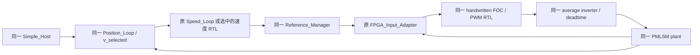

# Checkpoint D：三组真实系统联合仿真 walkthrough

三组 case 都在同一条原有电机链路上运行，只选择速度 PI 的来源。原 Simulink case 使用正式模型中的 float Speed_Loop；另外两组使用冻结的 HDL Coder baseline 和 Hand SV。此文说明承载结构与复现流程；完整场景是否通过，以各次 fresh run 的 `case_metrics.json`、`bit_true.json` 和最终比较报告为准。

先读 [Checkpoint B HDL Coder walkthrough](../checkpoint_b/hdl_coder_walkthrough.md)、[Checkpoint C 数值与 RTL 契约](../checkpoint_c/rtl_contract.md)，再看 [Checkpoint C 实测资源和时序](../checkpoint_c/final_rtl_comparison.md)。D 没有重新生成速度 PI，也没有修改 B1 或两份冻结的速度 RTL。

## 1. 哪些部分共用，速度 PI 在哪里切换



| case | 实际进入 Reference_Manager 的速度 PI | XSI 内选中的观察输出 |
|---|---|---|
| `original` | 原模型 float Speed_Loop | baseline shadow；与原 PI 数值、结果标志分开记录 |
| `coder_baseline` | Checkpoint B `HDLCore.sv` / `PI.sv` | baseline |
| `hand_sv` | Checkpoint C `speed_pi_sv.sv` | hand |

三组都使用 `CONTROL_BACKEND=1`，即既有 handwritten FOC backend。原来 `0/1` 的 backend 语义没有扩展为速度 PI 的三选一。速度来源是仅存在于 Study 模型副本中的独立 switch。[配置器](../../scripts/study_l1_d_configure.m#L21) 在专用 MATLAB batch 进程的 base workspace 设置原有 VariantExpression；没有修改正式 variant 定义或初始化文件。

原 float Speed_Loop 在每组中都原样保留、执行，供观察使用。RTL case 的选择开关位于它的输出和原 `Route_iq_speed` 之间；选择之后继续通过原 Reference_Manager。不要把 shadow 的输出误读成 original case 的实际控制输出。

## 2. 单个 XSI 实例如何承载两份速度 RTL和原 FOC

[Study 专用 composite top](../../handwritten/study_l1_system_cosim_top.sv#L10) 只有一个 50 MHz clock 和原 FOC `reset_n`。它原样实例化 [mc_foc_cosim_top](../../../../motor_control_ip/integration/rtl/mc_foc_cosim_top.sv#L3)，并同时运行 baseline 和 hand 两份速度 PI。两份速度 PI 的输入完全相同，global CE 固定为 1，初始化复位为同步的 `!reset_n`；语义上的 `speed_pi_reset` 仍是普通数据输入。

`speed_backend` 仅为 0=baseline、1=hand。两份速度 RTL 每次完成后都比较全部 14 项、409 bit raw code；选中的输出来自各自已有的事件保持寄存器，carrier 不增加数值运算或输出寄存器。

FOC 的 `iq_ref` **始终是外部输入**，来自共同 Reference_Manager 和原 FPGA_Input_Adapter。Composite top 不直接把内部速度 RTL 的 iq 接进 FOC。这样速度 PI 输出限幅之后，原参考管理、测试模式、安全 gating、原 FOC 定点转换均继续生效。

原 FPGA variant 的 11 输入/8 输出接口保留。Study 副本把其旧 HDL block 替换为接口相同的承载子系统；11 个输入仍由原 adapter 提供，8 个输出从根级唯一 XSI 实例返回。新增端口位于根级 Study XSI，参见 [完整端口表](../../scripts/study_l1_d_ports.m#L1) 和 [连线配置](../../scripts/study_l1_d_configure.m#L57)。正式 FOC、PWM RTL 和 inverter 接口没有修改。

速度入口单独使用 B1 的 S32/F20、Convergent、Saturate；原 FOC adapter 继续使用既有的 Nearest 规则。速度输出为 S25/F15。其他诊断位宽及 FL 与 C 的冻结契约相同。

[生成器](../../scripts/study_l1_d_generate.m#L9) 复用原 16 个 FOC source 和 4 个 integration/PWM source，再加入 baseline `PI.sv`、`HDLCore.sv`、hand `speed_pi_sv.sv` 和 Study top。这里只生成 XSI runtime，**没有编译 CSD 版，也没有第四个系统 case**。ROM 在新 runtime 和 wizard simulation 工作目录各放一份。所有 runtime 均位于新的 `.runtime/<name>` 下，原 `.Xil` runtime 保留。

## 3. 速度事件、物理完成与通信观察是三个时间

原 scheduler 的首个速度事件为 **0.9 ms**，之后每 **1 ms** 一次。送入 XSI 的 tick 在 100 us 控制 task 之间保持原值；RTL 检测其上升沿，持续 high 不会重复更新。两份速度 PI 只有有效事件才更新 x、previous excess 和输出，空闲 50 MHz clock 不积分。

冻结 RTL 的结构仍是一个输入寄存器边界和随后一个事件输出边界。若在 posedge 后启动输入，启动至完成为 40 ns；Checkpoint C 的 testbench 实际在 negedge 驱动，实测为 30 ns，随后 #1 ns 观察。D 的真实 XSI source event 也必须按实测 clock 相位计算，不能机械地给每个 Simulink 时间戳加 40 ns。

已完成的短运行实测：首个 clock 上升沿 `$time=10 ns`，全局 cycle ordinal 的 epoch 为 **-10 ns**。Counter 在 reset 期间也继续计数，ordinal 1 对应仿真首个上升沿。

| 首次速度更新的边界 | 实测时间 |
|---|---:|
| 原 scheduler / source event | 0.900000 ms |
| RTL 输入捕获 | 0.900010 ms |
| RTL 输出寄存器完成 | 0.900030 ms |
| 1 us 通信网格首次看到结果计数变化 | 0.901000 ms |

因此本 XSI 相位下是 source→capture 10 ns、capture→result 20 ns，source→physical result **30 ns**。`speed_source_cycle` 表示输入捕获，不是 source drive；其与 result cycle 相差 1。原 float PI 在自身 speed task 执行时完成，没有这个 RTL pipeline。两者的物理延迟不同，但原 0.9 ms/1 ms 更新规则不变。

`speed_result_valid` 只有一个 20 ns clock 周期，1 us 通信观察可能漏掉脉冲。D 使用持久的 `speed_result_count` 检出新结果，并保存实际 source/result cycle；[driver](../../scripts/study_l1_d_run.m#L16) 从 HDL 首沿 `$time` 取得 epoch，[提取器](../../scripts/study_l1_d_extract.m#L85) 校验每 1 us 恰好推进 50 个 clock，并把 cycle 转回物理时间。原 float case 的新结果计数来自其真实执行事件，另存的 shadow 计数不充当原 PI 的 result_valid。

## 4. 结果什么时候进入 Reference_Manager 和 FOC

RTL held iq 经根级 double conversion 和显式 **1 us Unit Delay** 返回 Control_Task，再由原有 **100 us** task 的 Reference_Manager 消费，见 [反馈入口和选择开关](../../scripts/study_l1_d_configure.m#L98)。这一通信与调度承载不改变速度算法，但其 transport delay 必须单独报告。物理 RTL 完成时间不是 Reference_Manager 的发布时间，也不是 FOC 的接受时间。

例如首个 RTL 结果在 0.900030 ms 完成、0.901000 ms 可观察，feedback hold 再经过一个通信 step；Reference_Manager 在随后一次 100 us task 消费它。原 float PI 可能在 0.900000 ms 同次 task 内进入管理器。由此产生的系统响应差别不能全部归因于定点量化。

FOC 继续按原 **100 us transaction** 运行，内部计算延迟仍为 512 clocks / 10.24 us；没有把积分周期改成计算延迟。1 us 观察网格中的首次 accepted 为 **51 us**，首次 active 为 **101 us**，之后均每 100 us 一次，accepted→active 为 50 us。这里列的是通信观察时间，不冒充真实 fabric 接受沿。

提取器分别保存 changed PI result 的物理时间、共同管理器发布时刻、首个接受该参考的 FOC command 和配对 active command。输出数值未改变的连续事件仍由计数记录；不能仅凭波形跳变认定事件有无。记录见每组 `speed_events.csv`、`trace.csv`、`case_metrics.json` 和本地 `result.mat`。

## 5. 模型保护、验证范围与复现

[配置器](../../scripts/study_l1_d_configure.m#L1) 从当前真实 `PMLSM_ThreeLoop_Simple.slx` 复制出 `.runtime/.../model/study_l1_system_tb.slx`。先加载原 ModelWorkspace 并核对冻结 PI 参数，再仅在私有副本中把 workspace 嵌入 Model File。场景输入、反馈桥、日志和 XSI 接口都只写入这个独立命名的副本。正式 SLX、本地初始化 m/MAT、原 FOC RTL不会被保存或覆盖。

共享块指纹覆盖原 Host、完整 Position_Loop、原 float Speed_Loop、scheduler、Reference_Manager、FOC Algorithm、plant、inverter 和 FPGA adapter 的计算参数与内部连接；新增暴露端口只改变 Study carrier。模型启动时再次核对有效控制周期、PI 参数、plant step、XSI clock/reset 和 backend，参见 [启动检查](../../scripts/study_l1_d_start.m#L1)。

默认 driver 运行三组 `speed_ideal`、三组 `speed_deadtime` 和三组 `convergence_prefix`，后者是 **0.2 s short position sanity**，没有完整位置整定或完整位置 settling 结论。每组独立重新加载模型和仿真状态；真实输出、故障、hold、事件覆盖、FOC accepted/active 和实际 B1 raw-code 对照通过后才标记 case 完成。

此次完整 fresh 验收采用下面的目录与顺序。它们已经存在，命令作为本次可追溯的复现记录；再次运行时使用下面说明的新名称，不覆盖当前验收证据。先在仓库根目录建立命令变量：

```powershell
Set-Location 'D:/Project/FPGA_XC7A200T'
$study = 'D:/Project/FPGA_XC7A200T/learning/study_l1_speed_pi_hdl_compare'
$studyScripts = "$study/scripts"
$matlabExe = 'D:/Program Files/MATLAB/R2026b/bin/matlab.exe'
$generationRun = 'd_xsi_fresh_01'
$workerPrefix = 'd_fresh'
$casePrefix = 'd_final'

# 1. 独立 read-only 源模型 / 参数 / 实际 licence 预检。
& $matlabExe -batch "addpath('$studyScripts'); study_l1_d_probe('d_probe_fresh_01');" -logfile "$study/.runtime/d_probe_fresh01.txt"
if ($LASTEXITCODE -ne 0) { throw 'D preflight failed' }

# 2. 新的 XSI generation / compilation。数学 RTL 都来自冻结 A/B/C。
& $matlabExe -batch "addpath('$studyScripts'); study_l1_d_generate('$generationRun');" -logfile "$study/.runtime/d_generate_fresh01.txt"
if ($LASTEXITCODE -ne 0) { throw 'D XSI generation failed' }

# 3. 从同一个新 compiled snapshot 复制三个独立 worker runtime。
python "$studyScripts/study_l1_d_snapshot.py" $generationRun $workerPrefix
if ($LASTEXITCODE -ne 0) { throw 'D worker snapshot failed' }

# 4. 三个独立 MATLAB batch 进程并行；每个进程顺序完成三个场景。
$workers = foreach ($implementation in @('original','coder_baseline','hand_sv')) {
    $workerName = "${workerPrefix}_${implementation}"
    $runName = "${casePrefix}_${implementation}"
    $batch = "addpath('$studyScripts'); study_l1_d_run('$workerName','$runName',{'speed_ideal','speed_deadtime','convergence_prefix'},{'$implementation'});"
    $log = "$study/.runtime/$runName.txt"
    Start-Process -FilePath $matlabExe -ArgumentList @('-batch',('"'+$batch+'"'),'-logfile',('"'+$log+'"')) -WindowStyle Hidden -PassThru
}
foreach ($worker in $workers) {
    $worker.WaitForExit()
    if ($worker.ExitCode -ne 0) { throw "D worker failed: process $($worker.Id)" }
}

# 5. 新 MATLAB 进程用当前 evaluator 核验全部真实 saved results；不重跑系统。
& $matlabExe -batch "addpath('$studyScripts'); study_l1_d_fresh_saved_verify('$casePrefix','fresh_saved_check');" -logfile "$study/.runtime/d_fresh_saved_verify02.txt"
if ($LASTEXITCODE -ne 0) { throw 'D fresh saved-data verification failed' }

# 6. 仅在九组 case、B1 raw replay 和 fresh verification 全部通过后发布。
python "$studyScripts/study_l1_d_publish.py" --generation-run $generationRun --generation-console d_generate_fresh01.txt --worker-prefix $workerPrefix --case-prefix $casePrefix --preflight-probe d_probe_fresh_01 --ingress-diagnostic d_golden_ingress_probe01 --fresh-verification-console d_fresh_saved_verify02.txt
if ($LASTEXITCODE -ne 0) { throw 'D evidence publication failed' }

# 7. 可选：只读 published CSV，生成三个可导出的 PNG；不加载/仿真模型。
& $matlabExe -batch "addpath('$studyScripts'); study_l1_d_plot;" -logfile "$study/.runtime/d_portable_figures01.txt"

# 8. 只读核验发布的数据、bit-true、source hashes、HTML payload 与本地保护。
python "$studyScripts/study_l1_d_verify.py" --workspace
```

九个 case 的原始数据在 `.runtime/d_final_<implementation>/<scenario>/<implementation>/`；每个目录有 `raw.mat`、`result.mat`、`case_metrics.json`、`bit_true.csv/json`、`speed_events.csv` 和 `foc_command_events.csv`。MAT / 私有 SLX / cache / XSI DLL 不进入 Git。发布后的紧凑证据位于 [verification](verification/)，生成和 worker snapshot manifests、compile log、源模型 probe、fresh verification console 在 [verification/runtime](verification/runtime/)。原先缺少脚本 path 的 fresh verifier 失败日志仍留在 `.runtime/d_fresh_saved_verify.txt`；采用已修正自加载 path 的 `d_fresh_saved_verify02.txt` 为最终证据。

四组 replay-ingress 诊断是独立诊断，不是第四个系统 case。其复現入口为 `study_l1_d_golden_probe(reportDir,probeDir)`，读取一个已有 short position prefix 的 `raw.mat`，对新 probe 目录输出 colon / integer timestamp、default / explicit ZOH 四组 CSV 和 summary。当前原始诊断为 `.runtime/d_golden_ingress_probe01/`，发布副本见 [replay_input_diagnostic](verification/replay_input_diagnostic/summary.json)。最终重放用整数索引 `n*Ts`，不修改 B1、真实波形或 speed tick 相位。

当前命名选项还用新的 `study_l1_d_fresh_saved_verify('d_final','fresh_saved_final03')` 和 `d_fresh_saved_verify03.txt` 独立复核，九组再次全部通过；这份当前代码 console 保存在 [fresh final current code](verification/runtime/fresh_final_current_code_console.txt)。三张实际 CSV 导出的 PNG 已进行本地目视检查：[ideal](verification/speed_ideal_comparison.png)、[deadtime](verification/speed_deadtime_comparison.png)、[position prefix](verification/convergence_prefix_comparison.png)。HTML 的嵌入数据与完整 CSV 逐值核验相等；浏览器策略禁止直接访问本地 file URL，本次没有宣称 HTML UI 已完成浏览器交互检查。

再次独立复核时，generation / probe / worker prefix / case prefix / logfile 都加未使用的新后缀，例如 `d_xsi_repro_02`、`d_probe_repro_02`、`d_worker_repro_02`、`d_result_repro_02`。Snapshot helper 支持 `source_run worker_prefix`；saved verifier 支持 `runPrefix,checkName`，例如 `study_l1_d_fresh_saved_verify('d_result_repro_02','fresh_saved_check_02')`。也可对本次 saved results 使用新 `checkName` 再次核验，完全不重新进行系统仿真。原报告和 PNG 已存在时，publish / plot 会拒绝替换；新运行结果先保留在其独立 `.runtime` 目录，不以新结果覆盖本次 review artifact。

MATLAB 要求 R2026b、Simulink、Fixed-Point Designer 和实际 licence feature **EDA_Simulator_Link=1**；实际 Vivado 路径为 `E:/AMDDesignTools/2026.1/Vivado/bin`。迁移到其他机器时先匹配安装路径及真实源模型的冻结数值语义。三个 worker 各自使用独立 batch 和 runtime，不占用用户已打开的 MATLAB 会话。`study_l1_d_verify.py` 仅需 Python 标准库；读别人下载的发布证据时省略 `--workspace`，该选项只适用于作者原始 checkout 的保护快照。

Checkpoint C 已实测 Hand SV 在 50 MHz 的 **WNS=-1.957 ns，setup 未通过**。D 是 behavioral RTL 系统联合仿真，未进行该失败路径的时序修复。即使三组系统场景通过，也不能写成 Hand SV 已具备 50 MHz 上板条件。Checkpoint D 不生成 bitstream，不操作硬件，不重新整定 PI，不修改现有 FOC，也不扩展后续 checkpoint。
